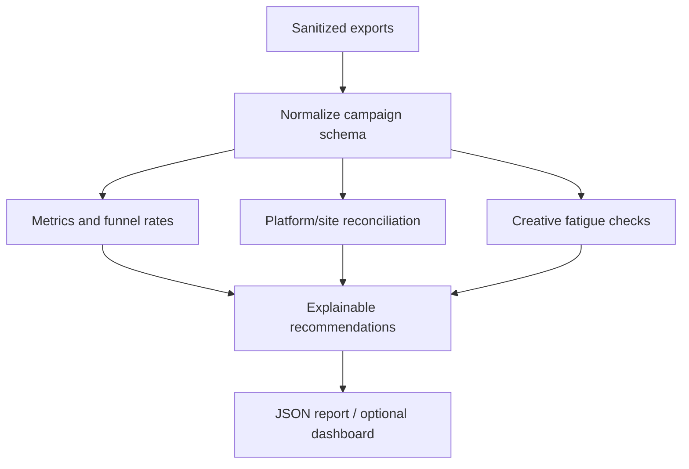

# E-commerce Growth Control Tower

> A synthetic, explainable analytics system for cross-channel campaign reconciliation and funnel-leak diagnosis.

This repository shows how a performance marketer can turn Meta, Google, TikTok, Shopify, and GA4-style exports into one decision layer. It is deliberately built around sanitized synthetic data so the methods are inspectable without exposing customer or account information.

It does **not** claim access to a live advertising account, production revenue, an official Triple Whale API, or a proven lift in ROAS.

## What the control tower answers

1. Which campaigns are delivering efficient traffic and purchases in the sample?
2. Where does the event funnel lose the most users?
3. Which platform counts disagree with the site-side event log?
4. Is a creative's click-through rate weakening over time?
5. Should a campaign be scaled, monitored, retested, or investigated for tracking?

## Architecture



## Example decision rules

The rules are intentionally transparent rather than pretending to be a black-box optimizer:

- **Scale:** purchase activity, ROAS above the demo guardrail, and healthy CTR.
- **Audit attribution:** landing-page views are materially below link clicks.
- **Fix checkout:** add-to-cart activity exists but checkout progression is absent.
- **Retest offer:** spend exists but purchase evidence is absent and the campaign has some engagement.
- **Monitor:** insufficient evidence for a stronger action.

Thresholds are documented in code and can be changed for a different business model.

## Run locally

The core pipeline uses only the Python standard library:

```bash
PYTHONPATH=src python -m control_tower.cli
PYTHONPATH=src python -m control_tower.cli --json > output/report.json
PYTHONPATH=src python -m control_tower.cli --markdown > output/report.md
PYTHONPATH=src python -m unittest discover -s tests -p 'test_*.py' -v
```

An optional Streamlit view is included for demonstration:

```bash
pip install -r dashboard/requirements.txt
PYTHONPATH=src streamlit run dashboard/app.py
```

## Repository map

```text
.
├── src/control_tower/
│   ├── analytics.py        # Funnel, campaign, reconciliation, fatigue metrics
│   ├── cli.py              # JSON/Markdown command-line report
│   ├── ingest.py           # Typed CSV ingestion
│   ├── models.py           # Campaign and reconciliation contracts
│   ├── recommendations.py  # Explainable action rules
│   └── report.py            # Report assembly and rendering
├── data/
│   ├── campaign_daily.csv  # Synthetic cross-channel campaign data
│   └── reconciliation.csv  # Synthetic platform/site event counts
├── dashboard/app.py        # Optional visual layer
├── tests/test_control_tower.py
├── docs/
│   ├── methodology.md
│   ├── data-contract.md
│   └── evidence-boundaries.md
└── .github/workflows/validate.yml
```

## Skills represented

**Media buying:** campaign pacing, creative comparison, retest/scale decisions, and channel-level performance reading.

**Backend measurement:** event reconciliation, attribution-scope warnings, funnel-stage diagnostics, and data-quality rules.

**Python and SQL-ready thinking:** typed ingestion, deterministic transformations, testable rules, and a stable output contract. The core is dependency-light so it can later be moved into DuckDB, BigQuery, or a warehouse without changing the analytical definitions.

**Tool coverage:** the schema can represent Meta Ads, Google Ads, TikTok Ads, Shopify, GA4, and dashboard-style fields commonly used by commerce analytics tools. It is not an official connector for those products.

## Data and claim hygiene

All values in `data/` are synthetic examples created for this portfolio project. They demonstrate calculations and decision logic; they are not presented as client results. Any real deployment would require account-level definitions for attribution windows, timezone, currency, refunds, consent, and revenue recognition.

## Author

**Syed Muslim Shah** — Technical Performance Marketer focused on acquisition testing, Shopify measurement, Pixel/CAPI diagnostics, and funnel analysis.
